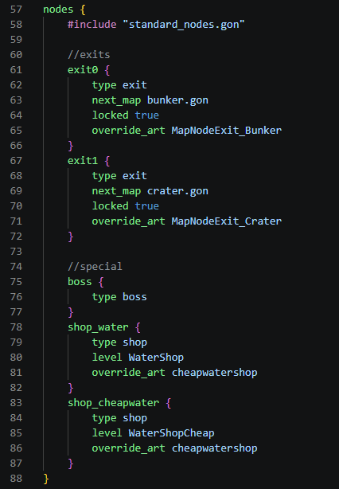

## GON Highlighter

[Visual Studio Marketplace](https://marketplace.visualstudio.com/items?itemName=polymeric.vscode-gon-highlighter) | [Open VSX](https://open-vsx.org/extension/polymeric/vscode-gon-highlighter) | [GitHub Releases](https://github.com/p0lymeric/vscode-gon-highlighter/releases)

GON Highlighter is a VS Code extension that provides basic highlighting for GON (Glaiel Object Notation) files, used by games built with the Glaiel Game Engine.

It is based off VS Code's basic JSON highlighter, and carries a similar feature set in terms of syntax colouring and bracket/quote/indentation autocompletion.

GON Highlighter may help you read and write GON files by colouring syntax. Unfortunately, it will not help you catch syntax errors or incorrect use of game-specific keywords, as it does not implement a language server or a schema verifier.

### Known limitations
- Bracket and quote autocompletion may not trigger unless the file is largely correct up to the editing point.

Feedback is highly appreciated. Please file bug reports or suggestions to the project's [GitHub repository](https://github.com/p0lymeric/vscode-gon-highlighter/issues).

### Licensing

MIT License. See [LICENSE.md](LICENSE.md) for details.

Based off VS Code's JSONC TextMate grammar. Copyright (c) 2015 - present Microsoft Corporation. MIT License.
